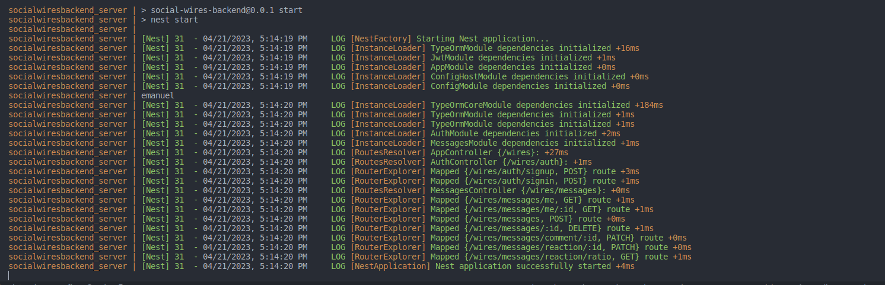

# SocialWiresBackend
## Pre Install 

To install this project you must install docker, docker-compose or install PostgreSQL and nodejs library

### docker-compose
If you want to change the username, port-forwarding or something you can edit docker-compose.yml. Just you have to change that in .env file too.
### .env files

To setup .env files you have to create or copy .env.example in `src/common/envs/` folder and replace the values.

|           |           |
|-----------|-----------|
|Path       |description|
|POSTGRES_HOST | address to PostgreSQL server|
|POSTGRES_PORT | port of PostgreSQL service|
|POSTGRES_NAME | username to login in PostgreSQL service|
|POSTGRES_PASSWORD | password to login in PostgreSQL service|
|DATABASE_NAME | database name in PostgreSQL|
|SECRET | secrete key for jwt token encryption|

### Installation with docker 

If you have all requirements you have to run `docker-compose up --build` if you want to run and keep terminal open, add `-d` flag if you want run as daemon process. 

### Installation without docker 

- In PostgreSQL terminal you have to execute the sql sentences written in Postgres.sql file.

- Running with nodejs and PostgreSQL you have to install node in version 18.13.0, move to the project folder then run the next commands

`npm install`
`npm run start:prod`

### Postman collection
The postman collection is setting up to automatize the authentication process and passing to each endpoint. You only have to login and use the others endpoints.

### Additional
I create a short functionality to see the reaction ratio of each user on their own messages.